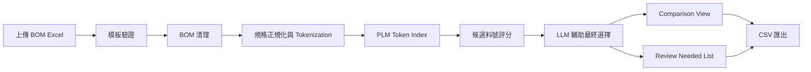
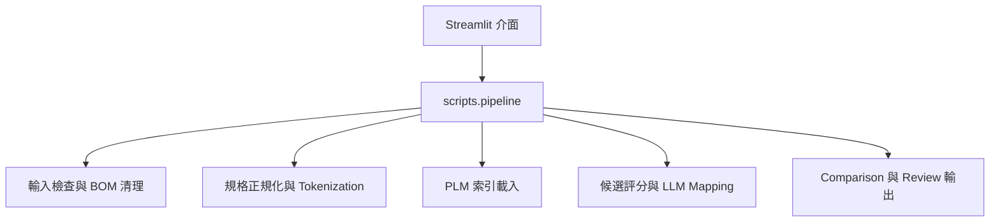

# AI 輔助 BOM 料號比對 External Demo

這個專案是對外展示用的 `AI` 輔助 `BOM` 料號比對流程範例，重點在於呈現一個可視化的工程資料處理流程：使用者上傳 `BOM` 後，系統先進行欄位檢查、資料清理與規格正規化，再根據 `PLM` 料號索引進行候選比對，最後透過 `LLM` 協助做最終推薦，並提供比較檢視與人工覆核清單。

## 系統架構圖

### 處理流程

### 模組結構

## 技術組成

- 前端介面：`Streamlit`
- 後端流程：Python 3
- 資料處理：`pandas`
- 輸入格式：Excel / CSV
- 比對策略：規格正規化 + 候選評分 + `LLM` 輔助選擇
- 輸出格式：各階段 `CSV` 匯出

## 流程說明

- BOM 上傳：使用者透過網頁介面上傳整理後的 `BOM` 檔案。
- 驗證與清理：系統檢查欄位格式、排除不應進入比對的資料列，並展開多個 `Location`。
- 正規化與切詞：將原始規格內容轉為可搜尋、可比較的 token 集合。
- 候選評分：使用 `BOM` token 與 `PLM` 料號索引進行比對，產生排序後的候選料號。
- LLM 輔助最終選擇：將候選結果送入 OpenAI-compatible `LLM` 端點，協助輸出推薦結果。
- 比較、覆核與匯出：產生群組化 mapping 結果、比較檢視，以及需要人工確認的 review 清單。

## 專案結構

- `app.py`：`Streamlit` 主介面與檢視流程入口。
- `scripts/pipeline.py`：共用 workflow orchestration 邏輯。
- `scripts/stages/input/`：`BOM` 驗證與清理流程。
- `scripts/stages/normalization/`：規格正規化與 `PLM` 索引處理。
- `scripts/stages/mapping/`：候選料號評分與 `LLM` 輔助選擇。
- `dict/`：token 展開與排除字典。

## Notes

此公開 demo 保留高層架構說明與主要程式結構，已移除敏感的測試檔、環境範本與部分操作文件。
