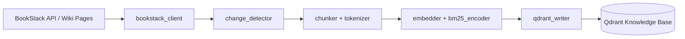
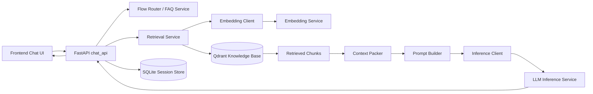

# RAG Chatbot External Demo

這個專案是一個對外展示用的 RAG Chatbot 範例，展示如何將知識庫內容從 BookStack 同步到 Qdrant，並透過 FastAPI chat service 完成檢索、上下文組裝與 grounded answer generation，最後提供給前端聊天介面使用。

## System Diagram

### Ingestion Flow

### Runtime Flow

## Tech Stack

- Backend API: `FastAPI`, Python 3
- Vector Database: `Qdrant`
- Knowledge Source: `BookStack API`
- Embedding / Inference: OpenAI-compatible API endpoints
- Retrieval Pipeline: dense retrieval + BM25 sparse encoding
- Session Storage: `SQLite`
- Frontend: vanilla `HTML` / `CSS` / `JavaScript`
- Testing: Python `unittest`

## Key Features

- 知識庫同步流程：從 BookStack 擷取頁面內容，做 heading-aware chunking、向量化與索引寫入。
- RAG 查詢流程：由 chat API 統一處理 FAQ、檢索、prompt 組裝與答案生成，前端不直接碰 Qdrant 或模型服務。
- 上下文控制：透過 context packing、chunk 數量限制與 token budget 控制輸入內容。
- 結構化對話：支援 FAQ flow、選項式引導與 AI handoff。
- Session 管理：使用 SQLite 保存 AI session 與歷史對話，支援多輪互動。
- 可嵌入前端：提供可作為 hosted chat 或 iframe widget 的前端介面。

## Repository Layout

- `chat_api/`：公開聊天 API、FAQ flow、retrieval 與 generation 核心程式。
- `sync_service/`：BookStack 同步、chunking、embedding、BM25 sparse encoding 與 Qdrant 寫入。
- `frontend/`：可嵌入的瀏覽器聊天介面。

## Notes

此公開 demo 保留高層架構說明與主要程式結構，已移除敏感的測試檔、環境範本與部分操作文件。
