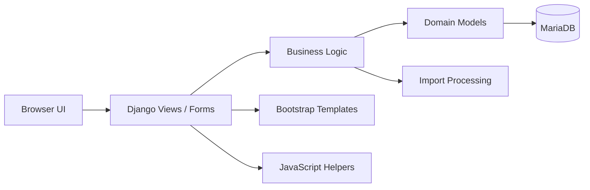

# Trytt System External Demo

這個專案是對外展示用的健身工作室管理系統 demo，展示如何以 Django 建立會員、教練、課程、訂單、授課紀錄與庫存管理流程。

## System Diagram

## Key Features

- 會員與教練管理：支援基本資料維護、狀態管理與關聯設定。
- 課程與訂單流程：支援課程建立、訂單管理、付款狀態與授課記錄。
- 庫存邏輯：包含課程堂數餘額與商品庫存追蹤。
- 匯入工具：支援 Excel 匯入、驗證、預覽與確認流程。
- 管理後台：包含 Django Admin 與客製管理頁面展示。

## Tech Stack

- Backend: `Python`, `Django`
- Database Layer: `MariaDB`
- Frontend: `Bootstrap 5`, `HTML`, `CSS`, `JavaScript`
- File Processing: `openpyxl`, `Pillow`

## Repository Layout

- `trytt_core/accounts/`: 會員、教練與帳號相關邏輯。
- `trytt_core/core/`: 課程、訂單、授課、庫存與匯入流程。
- `trytt_core/templates/`: 前端頁面與 admin 模板。
- `trytt_core/static/`: 前端互動腳本與靜態資源。
- `trytt_core/trytt_system/`: Django 專案設定與路由。
- `trytt_core/requirements.txt`: Python 依賴清單。

## Notes

此公開 demo 保留高層架構說明與主要程式結構，已移除敏感的測試檔、環境範本與部分操作文件。